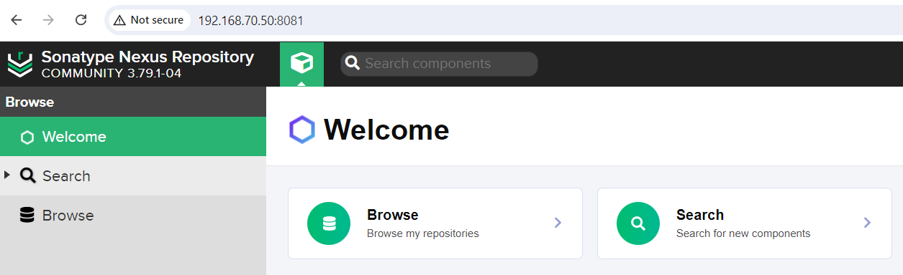
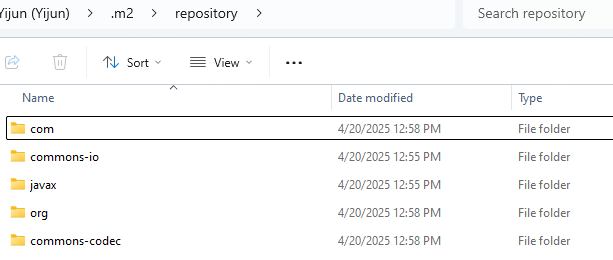
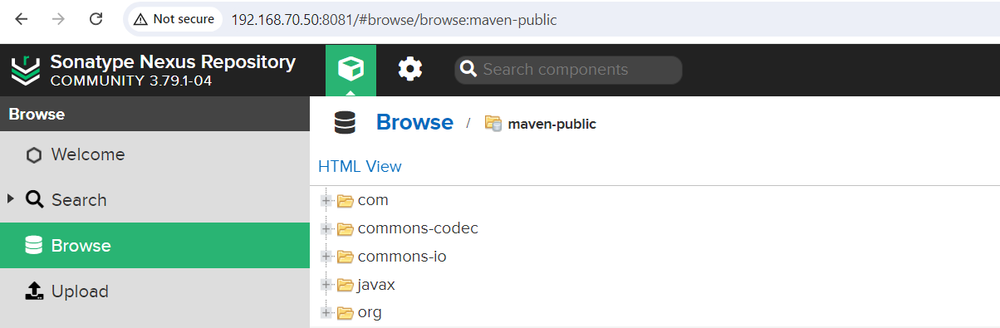
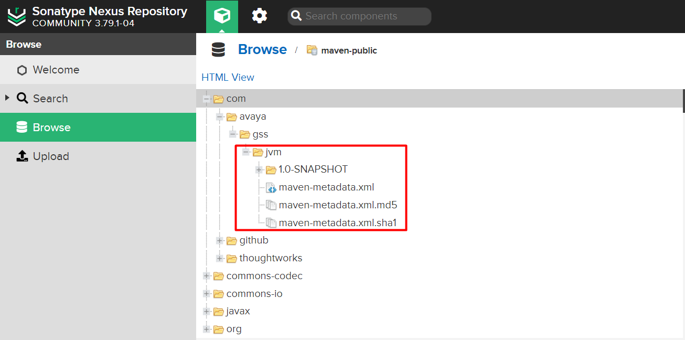

# Introduction to Maven

Apache Maven is a powerful build automation tool primarily used for Java projects. It simplifies project builds, dependency management, and project lifecycle handling through a unified configuration model.


## Lifecycle

In Maven, the build process is managed by lifecycles, each consisting of multiple phases. The three built-in lifecycles are:

- **default**: Handles core project tasks like deployment. Key phases include:

  - **validate**: Ensures project configuration is valid.

  - **compile**: Compiles source code.

  - **test**: Runs tests on compiled code.

  - **verify**: Ensures the build meets quality standards, validating artifacts after tests.

  - **package**: Packages code into a distributable format.

  - **install**: Installs to the local repository.

  - **deploy**: Deploys to a remote repository.

- **clean**: Manages cleanup of build artifacts.

- **site**: Generates project documentation.

Each phase can be triggered individually, executing specific goals like compiling or packaging.


## The POM (Project Object Model)

The `pom.xml` file is the heart of every Maven project. It contains metadata about the project and configuration details for building it.

Key elements in a POM:

- `<groupId>`: identifies the organization or group

- `<artifactId>`: the name of the project

- `<version>`: the current version

- `<dependencies>`: list of external libraries

- `<build>`: build-related configuration, including plugins

## Installing Maven to Windows

### 1. Download Maven 

Visit the official download page: https://maven.apache.org/download.cgi


### 2. Configure environment variable

Extract the archive to a preferred location.
Then set the `M2_HOME` and update the `Path` system variable to include `%M2_HOME%\bin`.


### 3. Verify

Open a terminal and run:

```bash
> mvn -v
Apache Maven 3.9.9 (8e8579a9e76f7d015ee5ec7bfcdc97d260186937)
Maven home: C:\Program Files (x86)\apache-maven-3.9.9
Java version: 21.0.6, vendor: Azul Systems, Inc., runtime: C:\Program Files\Zulu\zulu-21
Default locale: en_US, platform encoding: UTF-8
OS name: "windows 11", version: "10.0", arch: "amd64", family: "windows"
```

# Nexus

In modern development workflows, projects often rely on dozens or even hundreds of external libraries. Downloading dependencies directly from public repositories like Maven Central can be slow, insecure, or unreliable. Nexus addresses these issues by functioning as:

- A proxy for remote repositories (e.g., Maven Central, npm, PyPI)

- A hosted private repository for internal artifacts

- A deployment target for build tools like Maven, Gradle, or Docker


## Deploy Nexus on CentOS 8

```bash
## Download Nexus from the official site (https://help.sonatype.com/en/download.html)
wget --no-check-certificate -P /opt https://download.sonatype.com/nexus/3/nexus-3.79.1-04-linux-x86_64.tar.gz
tar zxvf /opt/nexus-3.79.1-04-linux-x86_64.tar.gz

## Deploy Nexus as a systemd service (https://help.sonatype.com/en/run-as-a-service.html)
ln -s /opt/nexus-3.79.1-04/bin/nexus /etc/init.d/nexus
vim /etc/systemd/system/nexus.service

  [Unit]
  Description=nexus service
  After=network.target
    
  [Service]
  Type=forking
  LimitNOFILE=65536
  ExecStart=/etc/init.d/nexus start
  ExecStop=/etc/init.d/nexus stop 
  User=nexus
  Restart=on-abort
  TimeoutSec=600
    
  [Install]
  WantedBy=multi-user.target

useradd nexus
chown -R nexus:nexus /opt/nexus-3.79.1-04
chown -R nexus:nexus /opt/sonatype-work

systemctl daemon-reload
systemctl enable nexus --now

## Open default port 8081
firewall-cmd --permanent --add-port=8081/tcp
firewall-cmd --reload
```
Once complete, you should be able to access Nexus via your web browser.




## Integrating Nexus with Maven

### 1. Configure Maven to Use Nexus

```bash
## %M2_HOME%\conf\settings.xml
<mirrors>
  <mirror>
    <id>nexus</id>
    <mirrorOf>*</mirrorOf>
    <name>Nexus Public Repository</name>
    <url>http://192.168.70.50:8081/repository/maven-public/</url>
  </mirror>
</mirrors>
```

### 2. Create a Sample Project with Maven

```bash

## Create the simplest of Maven projects, details in https://maven.apache.org/guides/getting-started/
> mvn archetype:generate -DgroupId=com.avaya.gss -DartifactId=jvm -DarchetypeArtifactId=maven-archetype-quickstart -DarchetypeVersion=1.5 -DinteractiveMode=false

## Generated project structure
> tree /f

Folder PATH listing for volume Avaya eSOE
Volume serial number is E206-78D2
C:.
│   pom.xml
│
├───.mvn
│       jvm.config
│       maven.config
│
└───src
    ├───main
    │   └───java
    │       └───com
    │           └───avaya
    │               └───gss
    │                       App.java
    │
    └───test
        └───java
            └───com
                └───avaya
                    └───gss
                            AppTest.java
```

### 3. Build the project

```bash
> mvn package
```

Maven will fetch dependencies from Nexus and store them in the local repository (`%USERPROFILE%\.m2\repository`). If Nexus doesn't already have them, it will download them from Maven Central.

Once the download is complete, the libraries will appear both in the local repository and in Nexus.





### 4. Upload Artifacts to Nexus

First, log in to the Nexus UI, navigate to `Security → Users`, and create a new local user account.


Next, add the user credentials to Maven’s `settings.xml`:

```bash
## %MAVEN_HOME%\conf\settings.xml
<servers>
  <server>
    <id>nexus-releases</id>
    <username>yijun</username>
    <password>passwd</password>
  </server>
  <server>
    <id>nexus-snapshots</id>
    <username>yijun</username>
    <password>passwd</password>
  </server>
</servers>
```

Then, configure the `distributionManagement` section in your project’s `pom.xml`:

```bash
## pom.xml
<distributionManagement>
  <repository>
    <id>nexus-releases</id>
    <url>http://192.168.70.50:8081/repository/maven-releases/</url>
  </repository>
  <snapshotRepository>
    <id>nexus-snapshots</id>
    <url>http://192.168.70.50:8081/repository/maven-snapshots/</url>
  </snapshotRepository>
</distributionManagement>
```

Finally, run the following command to deploy your artifact:

```bash
> mvn deploy
```

Once the deployment is complete, the artifact will be visible in the corresponding Nexus repository.

