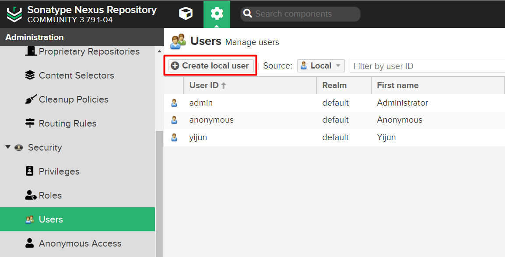

# Introduction to Maven

Apache Maven is a powerful build automation tool primarily used for Java projects. It simplifies project builds, dependency management, and project lifecycle handling through a unified configuration model.


## Lifecycle

In Maven, the build process is managed by lifecycles, each consisting of multiple phases. The three built-in lifecycles are:

- **default**: Handles core project tasks like deployment. Key phases include:

  - **validate**: Ensures project configuration is valid.

  - **compile**: Compiles source code.

  - **test**: Runs tests on compiled code.

  - **verify**: Ensures the build meets quality standards, validating artifacts after tests.

  - **package**: Packages code into a distributable format.

  - **install**: Installs to the local repository.

  - **deploy**: Deploys to a remote repository.

- **clean**: Manages cleanup of build artifacts.

- **site**: Generates project documentation.

Each phase can be triggered individually, executing specific goals like compiling or packaging.


## The POM (Project Object Model)

The `pom.xml` file is the heart of every Maven project. It contains metadata about the project and configuration details for building it.

Key elements in a POM:

- `<groupId>`: identifies the organization or group

- `<artifactId>`: the name of the project

- `<version>`: the current version

- `<dependencies>`: list of external libraries

- `<build>`: build-related configuration, including plugins

# Installing Maven to Windows

### 1. Download Maven 

Visit the official download page: https://maven.apache.org/download.cgi


### 2. Configure environemnt variable

Extract the archive to a preferred location.
Then set the `MAVEN_HOME` and update the `Path` system variable to include `%MAVEN_HOME%\bin`.


### 3. Verify

Open a terminal and run:

```bash
mvn -v
```
