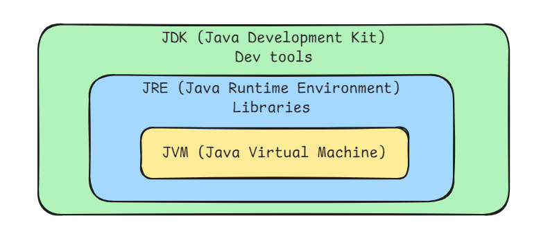
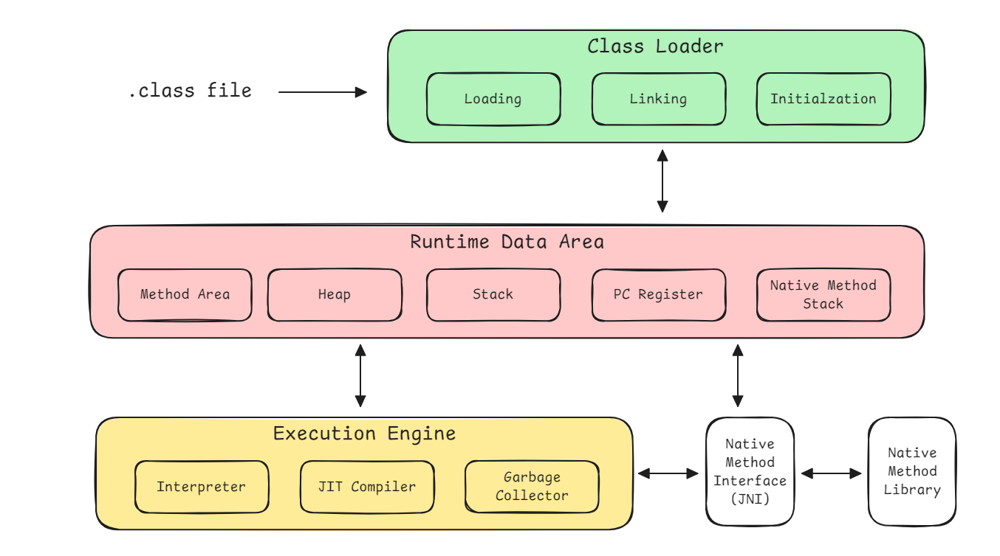

# Basis of JVM, JRE and JDK

Java is one of the most widely used programming languages in the world, and part of its power lies in its **platform independence**. This is made possible through the **Java Virtual Machine (JVM)**, **Java Runtime Environment (JRE)**, and **Java Development Kit (JDK)**. Together, these components form the foundation of Java's development and execution environment.

## JVM (Java Virtual Machine)

The JVM is a virtual machine that enables computers to run Java programs. It is responsible for interpreting compiled Java bytecode (`.class` files) and converting it into machine code that the host system can execute.

While the JVM is platform-dependent (meaning each operating system requires a specific JVM implementation), Java programs remain platform-independent. This is because the same `.class` files can run on any JVM implementation, regardless of the underlying system.

## JRE (Java Runtime Environment)

The JRE provides the libraries, Java class files, and other components needed to run Java applications. It includes the JVM, but not the development tools like compilers or debuggers.

The JRE consists of:

* **JVM**: The core component that executes Java bytecode.
* **Core Java Libraries**: Essential libraries (such as `rt.jar`) that support the execution of Java programs.
* **Supporting Files and Binaries**: Additional files needed to run Java programs.

If you're only running Java programs (not developing them), the JRE is all you need.

## JDK (Java Development Kit)

The JDK is a complete software development kit for Java developers. It includes everything in the JRE, plus tools for developing, debugging, and monitoring Java applications. If you're a developer, you need the JDK to write, compile, and run Java code.

The JDK consists of:

* **JRE** (which includes JVM)
* **Java Compiler** (`javac`): Converts Java source code into bytecode.
* **Debugger** (`jdb`): Helps developers debug Java applications.
* **JavaDoc Tool** (`javadoc`): Generates API documentation from Java source code.
* **Java Archive Tool** (`jar`): Packages Java applications and libraries into .jar files.
* **Other Command-line Utilities**: Tools like `jps`, `jstack`, `jmap`, `jstat`, and `jinfo` that interact with the JVM process for monitoring and diagnostics.

# JVM Architecture

The Java Virtual Machine (JVM) is the cornerstone of Java's "write once, run anywhere" philosophy. It provides an abstraction layer that allows Java bytecode to run on any device or operating system that has a compatible JVM.

## Class Loader Subsystem

The Class Loader is responsible for loading class files from various sources (e.g., file system, network). It performs three main functions:

* **Loading**: Finds and imports the binary representation of classes.
* **Linking**:
  * **Verification**: Ensures the bytecode adheres to JVM specifications and is safe to execute.
  * **Preparation**: Allocates memory for class variables and initializes them to default values.
  * **Resolution**: Replaces symbolic references in the constant pool with direct references.
* **Initialization**: Invokes class constructors and initializes static variables.

## Runtime Data Area

This is the memory area managed by the JVM during execution. It consists of several components:

* **Method Area**: Stores class-level data such as runtime constant pool, field and method data, and code for methods.
* **Heap**: The runtime data area from which memory for all class instances and arrays is allocated.
* **Java Stack**: Each thread has its own stack, which stores frames. Each frame contains local variables, operand stack, and references to the runtime constant pool.
* **Program Counter (PC) Register**: Holds the address of the currently executing JVM instruction for each thread.
* **Native Method Stack**: Used for executing native (non-Java) methods. It interfaces with the underlying operating system's native libraries.

## Execution Engine

This is the component responsible for executing the bytecode loaded into the JVM:

* **Interpreter**: Executes bytecode instructions line by line. It is simple and fast to start but slower in execution.
* **Just-In-Time (JIT) Compiler**: Compiles bytecode into native machine code at runtime for improved performance.
* **Garbage Collector (GC)**: Manages memory by automatically reclaiming objects that are no longer in use.