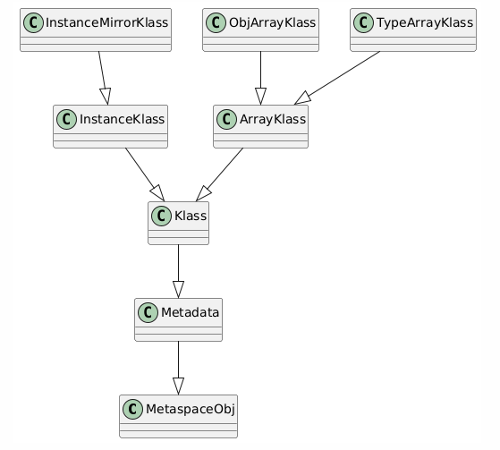

# Klass

In the HotSpot JVM, every Java type (including regular classes, arrays, and system classes) has a corresponding metadata structure in native memory known as a `Klass`. 

These `Klass` objects reside in the Metaspace, which replaced the PermGen memory area in Java 8 and later.





## Metaspace and Metadata

At the root of all metadata structures in the JVM lies the `MetaspaceObj` class. All objects allocated in the Metaspace, such as method information, constant pools, and class definitions, are derived from it.

`MetaspaceObj`: The base class for all objects stored in the JVM's Metaspace.

```cpp
// src/hotspot/share/memory/allocation.hpp
class MetaspaceObj {}
```
`Metadata`: A subclass of `MetaspaceObj`, representing metadata used by the JVM, including class and method information.

```cpp
// src/hotspot/share/oops/metadata.hpp
class Metadata : public MetaspaceObj {}
```

## The Klass Base

`Klass` is the central structure used by the JVM to represent type information. It provides the foundational layout for every Java type loaded into the JVM.

```cpp
// src/hotspot/share/oops/klass.hpp
class Klass : public Metadata {}
```

### InstanceKlass: Regular Java Classes
`InstanceKlass` is a subclass of `Klass` that represents typical Java classes (like java.lang.String, java.util.List, or any user-defined class).

It contains detailed metadata such as:

* Constant pool
* Method tables
* Field definitions
* Access flags
* Superclass and interfaces

```cpp
// src/hotspot/share/oops/instanceKlass.hpp
class InstanceKlass: public Klass {}
```

The `InstanceMirrorKlass` class is used internally to represent `java.lang.Class` objects. Every loaded Java class has an associated` Class<?>` object, and this subclass handles the native metadata that mirrors such instances.

It bridges the JVM’s internal representation of a class (`Klass`) with its reflection-level representation (`Class<?>` in Java code).

```cpp
// src/hotspot/share/oops/instanceMirrorKlass.hpp
class InstanceMirrorKlass: public InstanceKlass {}
```

### ArrayKlass: Representing Arrays
Arrays in Java are also first-class types, and the JVM treats them as special classes derived from ArrayKlass

This base is extended by two specialized subclasses:

`ObjArrayKlass`: For object arrays such as `String[]`, `Object[][]`, etc.

`TypeArrayKlass`: For primitive type arrays like `int[]`, `byte[]`, `boolean[]`.

These classes allow the JVM to efficiently manage memory layout and type checking for array objects.

```cpp
// src/hotspot/share/oops/klass.hpp
class ArrayKlass: public Klass {}

// src/hotspot/share/oops/objArrayKlass.hpp
class ObjArrayKlass : public ArrayKlass {}

// src/hotspot/share/oops/typeArrayKlass.hpp
class TypeArrayKlass : public ArrayKlass {}
```


