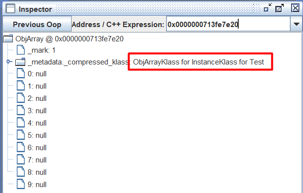

# Klass

In the HotSpot JVM, every Java type (including regular classes, arrays, and system classes) has a corresponding metadata structure in native memory known as a `Klass`. 

These `Klass` objects reside in the Metaspace, which replaced the PermGen memory area in Java 8 and later.


## Metaspace and Metadata

At the root of all metadata structures in the JVM lies the `MetaspaceObj` class. All objects allocated in the Metaspace, such as method information, constant pools, and class definitions, are derived from it.

`MetaspaceObj`: The base class for all objects stored in the JVM's Metaspace.

```cpp
// src/hotspot/share/memory/allocation.hpp
class MetaspaceObj {}
```
`Metadata`: A subclass of `MetaspaceObj`, representing metadata used by the JVM, including class and method information.

```cpp
// src/hotspot/share/oops/metadata.hpp
class Metadata : public MetaspaceObj {}
```

## The Klass Base

`Klass` is the central structure used by the JVM to represent type information. It provides the foundational layout for every Java type loaded into the JVM.

```cpp
// src/hotspot/share/oops/klass.hpp
class Klass : public Metadata {}
```

### InstanceKlass: Regular Java Classes
`InstanceKlass` is a subclass of `Klass` that represents typical Java classes (like java.lang.String, java.util.List, or any user-defined class).

It contains detailed metadata such as:

* Constant pool
* Method tables
* Field definitions
* Access flags
* Superclass and interfaces

```cpp
// src/hotspot/share/oops/instanceKlass.hpp
class InstanceKlass: public Klass {}
```

The `InstanceMirrorKlass` class is used internally to represent `java.lang.Class` objects. Every loaded Java class has an associated` Class<?>` object, and this subclass handles the native metadata that mirrors such instances.

It bridges the JVM’s internal representation of a class (`Klass`) with its reflection-level representation (`Class<?>` in Java code).

```cpp
// src/hotspot/share/oops/instanceMirrorKlass.hpp
class InstanceMirrorKlass: public InstanceKlass {}
```

### ArrayKlass: Representing Arrays
Arrays in Java are also first-class types, and the JVM treats them as special classes derived from ArrayKlass

This base is extended by two specialized subclasses:

`ObjArrayKlass`: For object arrays such as `String[]`, `Object[][]`, etc.

`TypeArrayKlass`: For primitive type arrays like `int[]`, `byte[]`, `boolean[]`.

These classes allow the JVM to efficiently manage memory layout and type checking for array objects.

```cpp
// src/hotspot/share/oops/klass.hpp
class ArrayKlass: public Klass {}

// src/hotspot/share/oops/objArrayKlass.hpp
class ObjArrayKlass : public ArrayKlass {}

// src/hotspot/share/oops/typeArrayKlass.hpp
class TypeArrayKlass : public ArrayKlass {}
```

# Java Objects in JVM Memory

In the JVM, every object consists of two main components: 

**Object Header**: contains metadata such as:

* A Mark Word that stores the object's hash code, garbage collection state, and synchronization information.
* A Class Pointer that references the class metadata (often called the `Klass` pointer).
* An additional field (for array objects) that stores the array length.

**Object Body**: stores the actual data fields defined by the class, including any inherited fields.

## Verifying Object Layout with HSDB

The **HotSpot Debugger (HSDB)** is a tool that allows inspection of a running Java program. It makes it possible to observe how Java objects are laid out in memory and how each object's `Klass` pointer links to its class metadata. 

For example, consider the following Java program:

```java
public class Test {
	
	int para1 = 10;
	int para2 = 20;

    public static void main(String[] args) {
		Test instance = new Test();
		int[] type_array = new int[10];
		Test[] instance_array = new Test[10];
		while(true);
    }
}
```

This program creates a `Test` object, an `int[]` array of length 10, and a `Test[]` array of length 10. The `while(true)` loop keeps the program running so that HSDB can attach to it. Compile and run this program, then attach HSDB to the running process. 

In HSDB's Stack View for the main thread, the objects created by this program appear in order:
* A `Test` object
* An `int[]` array
* A `Test[]` array

Each local variable holds a reference to the memory address where the corresponding object resides in the heap.


### Test instance object

This `Test` object is located at address `0x713fe7d60` and has two integer fields: `para1` and `para2`.


### int[] array object

This `int[]` array object is located at address `0x713fe7d78` and contains 10 integer elements.


### Test[] array object

This `Test[]` array object is located at address `0x713fe7e20` and has length 10, meaning it contains 10 slots for references to `Test` objects.



