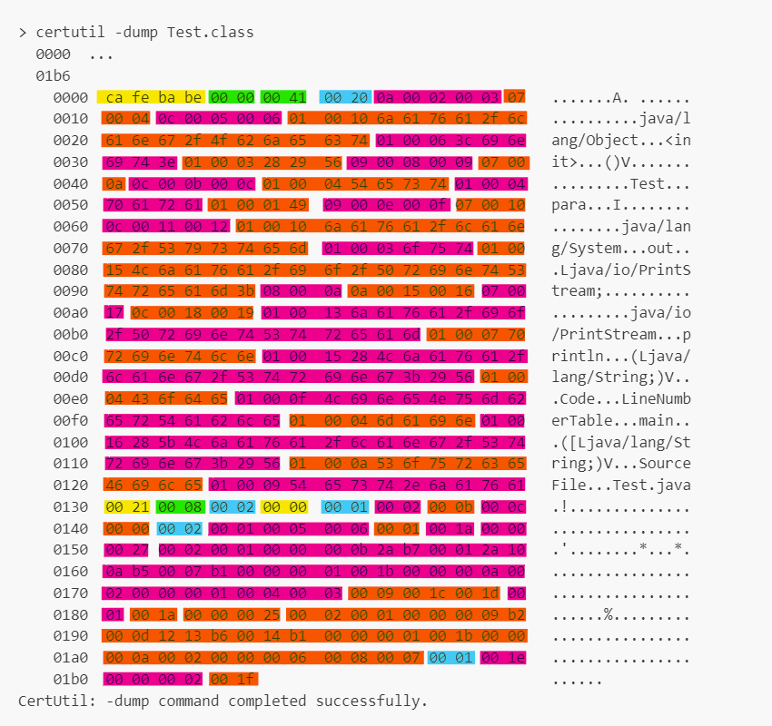

# Class File Structure

A Java `.class` file is the result of compiling a `.java` source file. It is a binary file that contains all the necessary information for the JVM to understand, load, and execute the class.

The Java class file format is strictly defined:

```cpp
ClassFile {
    u4             magic;
    u2             minor_version;
    u2             major_version;
    u2             constant_pool_count;
    cp_info        constant_pool[constant_pool_count-1];
    u2             access_flags;
    u2             this_class;
    u2             super_class;
    u2             interfaces_count;
    u2             interfaces[interfaces_count];
    u2             fields_count;
    field_info     fields[fields_count];
    u2             methods_count;
    method_info    methods[methods_count];
    u2             attributes_count;
    attribute_info attributes[attributes_count];
}
```

### Magic Number (4 bytes)

The magic number is a fixed value `0xCAFEBABE` that identifies the file as a valid Java class file.

### Version Information (4 bytes)

The version section records the Java compiler version:

- `minor_version` (2 bytes)

- `major_version` (2 bytes)

This ensures that the JVM can verify compatibility before loading the class.

### Constant Pool

The constant pool is a table of constants used throughout the class, including:

* Literals (e.g., string values, integers)
* Class names
* Field names
* Method names
* Type descriptors

### Access Flags (2 bytes)

The access flags define the properties of the class, such as:

* Public
* Final
* Abstract
* Interface

### This Class and Superclass (2 bytes each)

- `this_class` contains an index into the constant pool that points to the class name.
- `super_class` contains an index into the constant pool that points to the superclass name.

### Interfaces

Interfaces implemented by the class are listed as an array of constant pool indices. 

Each entry refers to an interface type that the class claims to implement.

### Fields

The fields section lists all the variables declared in the class. For each field, the information includes:

* Access flags (such as `private`, `static`)
* Name index
* Descriptor index (type information)
* Additional attributes (such as `ConstantValue`)

### Methods
The methods section provides metadata for each method, including:

* Access flags
* Name index
* Descriptor index (parameter and return types)
* Attributes (such as the method’s bytecode instructions)

Constructors are also included in this section as special methods named `<init>`.

### Attributes

Attributes offer additional metadata about the class, methods, and fields. Common examples include:

* `Code` (containing bytecode for methods)
* `LineNumberTable` (used for debugging)
* `SourceFile` (indicating the original `.java` file)

Each attribute has a name index, a length, and specific content.


# Analyze a Simple Class File

Let's start with a very simple Java program:
```java
public class Test {
	
	private int para = 10;

    public static void main(String[] args) {
		System.out.println("Test");
    }
}
```

First, compile it, then use `certutil` in CMD to dump its hex content:

```cmd
> certutil -dump Test.class
  0000  ...
  01b6
    0000  ca fe ba be 00 00 00 41  00 20 0a 00 02 00 03 07   .......A. ......
    0010  00 04 0c 00 05 00 06 01  00 10 6a 61 76 61 2f 6c   ..........java/l
    0020  61 6e 67 2f 4f 62 6a 65  63 74 01 00 06 3c 69 6e   ang/Object...<in
    0030  69 74 3e 01 00 03 28 29  56 09 00 08 00 09 07 00   it>...()V.......
    0040  0a 0c 00 0b 00 0c 01 00  04 54 65 73 74 01 00 04   .........Test...
    0050  70 61 72 61 01 00 01 49  09 00 0e 00 0f 07 00 10   para...I........
    0060  0c 00 11 00 12 01 00 10  6a 61 76 61 2f 6c 61 6e   ........java/lan
    0070  67 2f 53 79 73 74 65 6d  01 00 03 6f 75 74 01 00   g/System...out..
    0080  15 4c 6a 61 76 61 2f 69  6f 2f 50 72 69 6e 74 53   .Ljava/io/PrintS
    0090  74 72 65 61 6d 3b 08 00  0a 0a 00 15 00 16 07 00   tream;..........
    00a0  17 0c 00 18 00 19 01 00  13 6a 61 76 61 2f 69 6f   .........java/io
    00b0  2f 50 72 69 6e 74 53 74  72 65 61 6d 01 00 07 70   /PrintStream...p
    00c0  72 69 6e 74 6c 6e 01 00  15 28 4c 6a 61 76 61 2f   rintln...(Ljava/
    00d0  6c 61 6e 67 2f 53 74 72  69 6e 67 3b 29 56 01 00   lang/String;)V..
    00e0  04 43 6f 64 65 01 00 0f  4c 69 6e 65 4e 75 6d 62   .Code...LineNumb
    00f0  65 72 54 61 62 6c 65 01  00 04 6d 61 69 6e 01 00   erTable...main..
    0100  16 28 5b 4c 6a 61 76 61  2f 6c 61 6e 67 2f 53 74   .([Ljava/lang/St
    0110  72 69 6e 67 3b 29 56 01  00 0a 53 6f 75 72 63 65   ring;)V...Source
    0120  46 69 6c 65 01 00 09 54  65 73 74 2e 6a 61 76 61   File...Test.java
    0130  00 21 00 08 00 02 00 00  00 01 00 02 00 0b 00 0c   .!..............
    0140  00 00 00 02 00 01 00 05  00 06 00 01 00 1a 00 00   ................
    0150  00 27 00 02 00 01 00 00  00 0b 2a b7 00 01 2a 10   .'........*...*.
    0160  0a b5 00 07 b1 00 00 00  01 00 1b 00 00 00 0a 00   ................
    0170  02 00 00 00 01 00 04 00  03 00 09 00 1c 00 1d 00   ................
    0180  01 00 1a 00 00 00 25 00  02 00 01 00 00 00 09 b2   ......%.........
    0190  00 0d 12 13 b6 00 14 b1  00 00 00 01 00 1b 00 00   ................
    01a0  00 0a 00 02 00 00 00 06  00 08 00 07 00 01 00 1e   ................
    01b0  00 00 00 02 00 1f                                  ......
CertUtil: -dump command completed successfully.
```

The hex output represents the `.class` file's binary structure.

Now, let's highlight the key sections:

For detailed specifications of each entry, please refer to https://docs.oracle.com/javase/specs/jvms/se7/html/jvms-4.html



* 0x000 - 0x003: magic number (0xcafe babe), identifies this as a Java class file
* 0x004 - 0x005: minor version (0x0)
* 0x006 - 0x007: major version (0x41, corresponds to Java 21)
* 0x008 - 0x009: constant pool count (0x20)
* 0x00a - 0x12f: constant pool entries
* 0x130 - 0x131: access flags (0x21, ACC_PUBLIC, ACC_SUPER)
* 0x132 - 0x133: this class (0x08, "Test")
* 0x134 - 0x135: super class (0x02, "java/lang/Object")
* 0x136 - 0x137: interface count (0x0)
* 0x138 - 0x139: field count (0x1)
* 0x13a - 0x141: field information
* 0x142 - 0x143: method count (0x2, methods: constructor and main)
* 0x144 - 0x1ab: method information
* 0x1ac - 0x1ad: attribute count (0x1, attribute: SourceFile)
* 0x1ae - 0x1b6: attribute information

Of course, manually analyzing hex is tedious.

The JDK provides a very useful tool: `javap`. We can decompile and view the class structure easily:

```cmd
> javap -v Test.class
  Last modified Apr 28, 2025; size 438 bytes
  SHA-256 checksum 7779e6bd253eafc1e0cb473407b6d47669f7b1649fb7d7bc61d09336c40b198f
  Compiled from "Test.java"
public class Test
  minor version: 0
  major version: 65
  flags: (0x0021) ACC_PUBLIC, ACC_SUPER
  this_class: #8                          // Test
  super_class: #2                         // java/lang/Object
  interfaces: 0, fields: 1, methods: 2, attributes: 1
Constant pool:
   #1 = Methodref          #2.#3          // java/lang/Object."<init>":()V
   #2 = Class              #4             // java/lang/Object
   #3 = NameAndType        #5:#6          // "<init>":()V
   #4 = Utf8               java/lang/Object
   #5 = Utf8               <init>
   #6 = Utf8               ()V
   #7 = Fieldref           #8.#9          // Test.para:I
   #8 = Class              #10            // Test
   #9 = NameAndType        #11:#12        // para:I
  #10 = Utf8               Test
  #11 = Utf8               para
  #12 = Utf8               I
  #13 = Fieldref           #14.#15        // java/lang/System.out:Ljava/io/PrintStream;
  #14 = Class              #16            // java/lang/System
  #15 = NameAndType        #17:#18        // out:Ljava/io/PrintStream;
  #16 = Utf8               java/lang/System
  #17 = Utf8               out
  #18 = Utf8               Ljava/io/PrintStream;
  #19 = String             #10            // Test
  #20 = Methodref          #21.#22        // java/io/PrintStream.println:(Ljava/lang/String;)V
  #21 = Class              #23            // java/io/PrintStream
  #22 = NameAndType        #24:#25        // println:(Ljava/lang/String;)V
  #23 = Utf8               java/io/PrintStream
  #24 = Utf8               println
  #25 = Utf8               (Ljava/lang/String;)V
  #26 = Utf8               Code
  #27 = Utf8               LineNumberTable
  #28 = Utf8               main
  #29 = Utf8               ([Ljava/lang/String;)V
  #30 = Utf8               SourceFile
  #31 = Utf8               Test.java
{
  public Test();
    descriptor: ()V
    flags: (0x0001) ACC_PUBLIC
    Code:
      stack=2, locals=1, args_size=1
         0: aload_0
         1: invokespecial #1                  // Method java/lang/Object."<init>":()V
         4: aload_0
         5: bipush        10
         7: putfield      #7                  // Field para:I
        10: return
      LineNumberTable:
        line 1: 0
        line 3: 4

  public static void main(java.lang.String[]);
    descriptor: ([Ljava/lang/String;)V
    flags: (0x0009) ACC_PUBLIC, ACC_STATIC
    Code:
      stack=2, locals=1, args_size=1
         0: getstatic     #13                 // Field java/lang/System.out:Ljava/io/PrintStream;
         3: ldc           #19                 // String Test
         5: invokevirtual #20                 // Method java/io/PrintStream.println:(Ljava/lang/String;)V
         8: return
      LineNumberTable:
        line 6: 0
        line 7: 8
}
SourceFile: "Test.java"
```