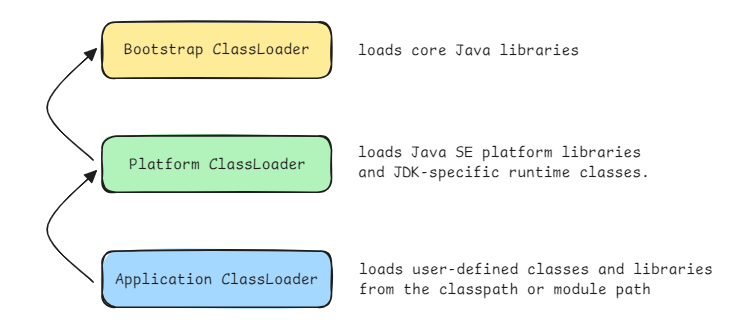
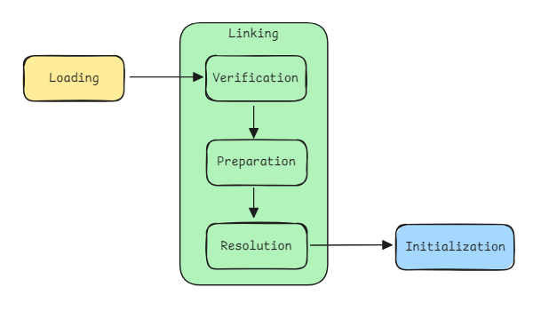

# ClassLoader

A **ClassLoader** in the JVM is responsible for finding and loading class definitions into the runtime. In addition to classes, a ClassLoader also locates other resources (such as configuration files or images). 

ClassLoaders use a **parent delegation model**: when a loader is asked to load a class or resource, it typically delegates the request up to its parent loader before attempting to find the class itself.This ensures core system classes are loaded by the bootstrap loader (the ultimate parent).

## Built-in ClassLoaders and Delegation

The JVM provides three main built-in ClassLoaders that work together using the parent delegation model:

### Bootstrap ClassLoader

The VM’s core loader, implemented in native code. It loads the core Java platform classes (e.g. in `java.base`). It has no parent (represented as `null` in the ClassLoader API).

### Platform (Extension) ClassLoader

It loads classes from the platform (formerly extension) class path. It makes all Java SE platform APIs (and their implementations/JDK runtime classes) visible to applications .

It is the parent of the application loader.

### Application (System) ClassLoader

The default loader for application classes on the classpath/module path. It loads user classes and libraries. Its parent is the platform loader. 

For example, if the application loader is asked to load a class, it first asks the platform loader, which in turn asks the bootstrap loader. Only if the class is not found in the parent hierarchy does the child loader attempt to find it itself. This delegation model ensures core classes are loaded once and enforces sandboxing.

## Class Loading Phases

The Java Virtual Machine (JVM) prepares a class for use through three main phases: **Loading**, **Linking**, and **Initialization**. These phases are performed in a controlled and often **lazy** (on-demand) manner to ensure performance, correctness, and security.

### Loading

In the loading phase, the JVM finds the `.class` file for a given class name and reads its bytecode into memory. This is handled by a **ClassLoader** (either system-provided or custom).

The JVM parses the bytecode and creates an internal data structure called `InstanceKlass`, which holds all metadata about the class: constant pool, fields, methods, access flags, and more.

At the same time, the JVM creates a `java.lang.Class<?>` object on the Java heap, called the **class mirror**, which represents the class in Java programs. This mirror links to the internal `InstanceKlass`.

By the end of loading, the class is present in memory and recognized by the JVM (but it hasn't yet been checked for safety, nor have its static variables been initialized). All references to other classes, fields, and methods are still symbolic (meaning they're stored as names, not actual memory pointers).

### Linking

Linking integrates the class into the JVM runtime and prepares it for execution. It consists of three steps:

* **Verification**: checks that the class file follows the JVM’s safety rules. It makes sure the bytecode is well-formed, method and field references are valid, and the code doesn't do anything unsafe or illegal. This step protects the JVM from crashes or security issues caused by broken or malicious class files.

* **Preparation**: allocates memory for all static variables and assigns them default value. This step doesn't run any Java code. Static initializers and static blocks are not executed yet.

* **Resolution**: replaces symbolic references (like `java/lang/String`) with direct references to their actual locations in memory. This process can happen immediately during linking or be delayed (**lazy resolution**) until the reference is first used. Once resolved, the result is cached so the JVM doesn't need to look it up again.

### Initialization

Initialization is when the JVM runs a class’s static code. This includes static variable initializers and static blocks, which are combined by the Java compiler into a special method called `<clinit>`.

The JVM uses **lazy initialization**, meaning that a class is only initialized when it’s actually needed. This saves resources if a class is never used.

A class is initialized in the following cases:

* **Creating an instance**: new `MyClass()` triggers initialization of `MyClass`.
* **Accessing static fields or methods**: Calling `MyClass.staticMethod()` or referencing a static variable starts initialization.
* **Reflection or method handles**: Methods like Class.`forName("MyClass")` or reflective access to fields/methods also cause initialization.
* **Main class startup**: The JVM automatically initializes the class containing the `main()` method at program start.
* **Superclass initialization**: If a subclass is initialized, its superclass is initialized first, automatically handled by the JVM.

To ensure thread safety, the JVM synchronizes class initialization: only one thread can initialize a class at a time. Others trying to access the same class will wait until initialization completes.