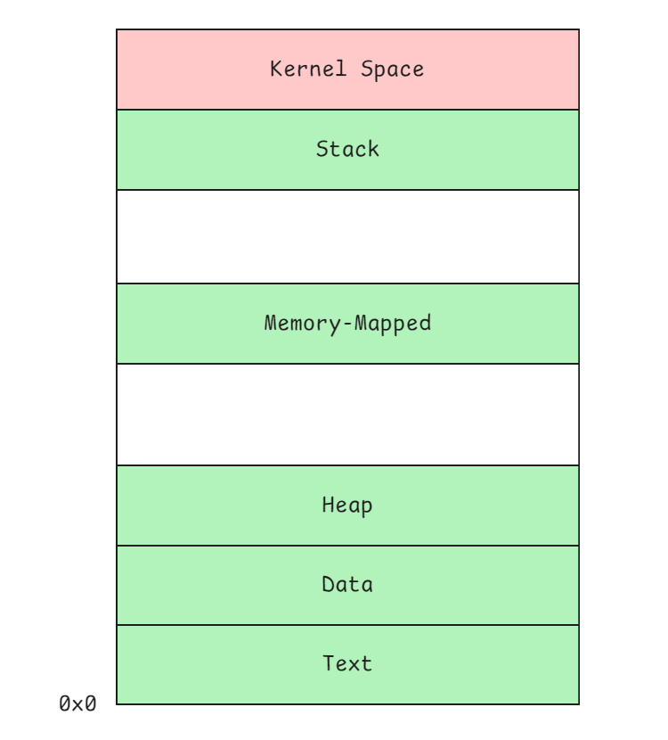
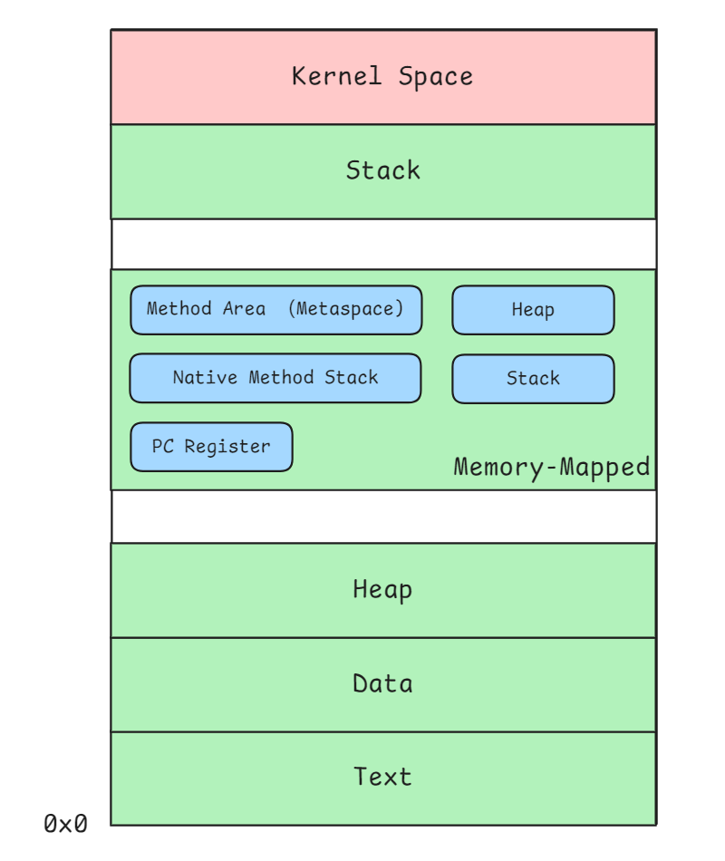

# Linux Process Memory Layout

When a program runs on a Linux system, it becomes a process, which is given its own private memory space. This memory is organized into several distinct regions, each serving a specific purpose.



## Kernel Space

Kernel space is a protected area of memory where the core part of the operating system (the kernel) resides. 

The kernel manages hardware, schedules tasks, and provides essential system services. This region is shared and consistent across all processes, but user programs cannot directly access it for safety and stability reasons.


## User space

User space is where applications and their associated data reside. Each process has its own isolated user space, preventing one process from accessing or interfering with another’s memory.

User space memory is typically divided into the following regions:

### 1. Stack

The stack stores function call information, including local variables, function parameters, and return addresses. It grows downward in memory (from high to low addresses) and is created separately for each thread.


### 2. Memory-Mapped Area

This region is used to map files or hardware devices directly into the process's address space. It allows the program to access file contents as if they were part of memory, which can be more efficient than traditional file I/O.


### 3. Heap

The heap is used for dynamic memory allocation. When a program requests memory at runtime (e.g., using `malloc` in C), that memory comes from the heap. Unlike the stack, the heap grows upward in memory.


### 4. Data Segment

The data segment holds global and static variables. It is further divided into three parts:

#### .bss (Uninitialized Data)

Holds global and static variables that are declared but not initialized:

```c
int total;
```

Although these variables take up space in memory at runtime, they don’t occupy space in the executable file. They are automatically initialized to zero by the system loader.

#### .data (Initialized Data)

Stores global and static variables that are explicitly initialized in the code:

```c
int counter = 10; 
```

The value is loaded into memory when the program starts.

#### .rodata (Read-Only Data)

Stores constants and read-only literals, such as string constants:

```c
const char* msg = "Hello, world!";
```

Since this data is read-only, attempting to modify it will result in a segmentation fault.

###  5. Text Segment

Also known as the code segment, this area contains the executable instructions of the program. 

It is usually marked as read-only and may be shared among processes running the same program to conserve memory.


# JVM Memory Layout

When a Java program runs, the JVM manages its memory using several well-defined regions. These regions are designed for specific purposes (some are shared among all threads, while others are private to each thread).



### Method Area

The method area stores class-level information that is shared among all threads. It holds **class metadata** such as field names, method signatures, **bytecode for methods and constructors**, **static variables**, and the **runtime constant pool**.

In modern JVM implementations (Java 8 and later), this region is called **Metaspace**. Unlike older versions where the method area resided in the heap, Metaspace allocates memory directly from the **native memory** (memory-mapped space), allowing it to grow more flexibly with application demand.

### Heap

The heap is the main area for dynamic memory allocation. All **objects** and **arrays** created with `new` are stored here. This memory region is shared by all threads in the JVM.

The heap is managed by the **garbage collector**, which automatically reclaims memory that is no longer in use. Depending on how the JVM is configured, the heap can grow or shrink during program execution.

### Stack

Each thread has its own Java stack, created at the same time as the thread. The stack keeps track of method calls and their execution state. It stores a series of **frames**, one for each active method. Each **frame** contains the method's **local variables**, the **operand stack**, and **information needed to return** to the calling method.

The stack automatically expands and contracts as methods are called and return.


### Native Method Stack

The native method stack is used when Java calls methods written in other languages (like C or C++ via JNI). It manages the transition between Java and native code.

The native method stack is created when the thread starts and tracks method arguments. During native method execution, the operating system's stack is used.


### PC (Program Counter) Register

Each JVM thread has its own PC register. This tiny memory area keeps track of which bytecode instruction is currently being executed. It helps the JVM resume execution at the correct place after each instruction.

If the current method is a native method, the value of the PC register is undefined. Otherwise, it always contains the address of the next instruction to execute.

