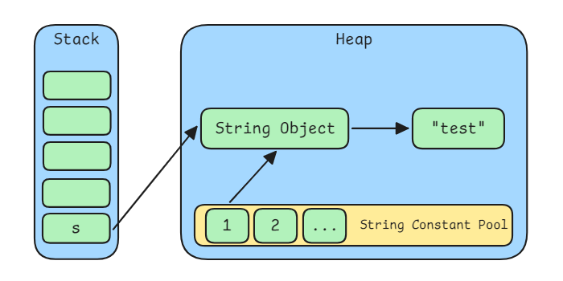

# Constant Pools in JVM

Java uses several mechanisms to manage constant values and symbolic references efficiently. These mechanisms are often called "constant pools," but they refer to different parts of the system with different roles. Even though they share similar names, these constant pools are quite different in how they work and what they are used for.


## Class Constant Pool

The **Class Constant Pool** is a section inside every `.class` file generated by the Java compiler. It stores all the literal values and symbolic references needed by the class. This includes string literals, numeric constants, class names, field names, method names, and descriptors.

Each entry in the constant pool is assigned an index, and the bytecode instructions use these indices to refer to constants. The structure and format of the class constant pool are strictly defined by the Java Virtual Machine Specification.

The Class Constant Pool is a static, file-level structure. It exists only in the compiled class file and is read by the JVM during class loading.

## Runtime Constant Pool

The **Runtime Constant Pool** is a data structure created by the JVM for each class or interface when it is loaded. It originates from the constant pool in the class file, which contains symbolic information.  At runtime, these symbolic entries are resolved into actual references (for example, direct pointers to runtime objects like classes and methods).

In addition to constants from the class file, the Runtime Constant Pool can also store dynamically generated entries, such as those created by the `invokedynamic` instruction.

Each class or interface has its own instance of the Runtime Constant Pool in the method area.

## String Constant Pool

JVM uses a special memory area called the **String Constant Pool** to store string literals. This pool ensures that identical string literals share the same memory reference.

When a string literal appears in the code, the JVM checks whether it already exists in the pool. If it does, the existing reference is used. If not, the literal is added to the pool.

The use of the string constant pool reduces memory usage and allows faster string comparison using references. Since Java 7, the pool has been located in the heap memory, allowing better memory management.

# Creating a String Object

What happens when a String object is created?

## Obtain String metadata

During JVM boot up, the **Bootstrap ClassLoader** loads the core Java libraries (`rt.jar` in JDK 8, or modules in JDK 9 and later). `java.lang.String` is one of these classes. After its bytecode is parsed, the JVM creates an `InstanceKlass` object to represent its metadata, which is stored in the Metaspace.

## instantiate a String object

When a Java object is instantiated, the JVM allocates an `instanceOopDesc` in the heap. Each object consists of:
- an object header containing a mark word a klass pointer (to its `InstanceKlass`)
- the memory space for its instance fields defined by that class.


## Operations in String Constant Pool

The JVM maintains a special data structure called the `StringTable`, also known as the **String Constant Pool**, to store String objects. `StringTable` is a hash table that holds references (oop) to String objects.

When a string is interned, the JVM first computes its hash code and looks it up in the `StringTable`.

- If a matching string already exists, the JVM returns the existing String object.

- If no match is found, a new String object is created, added to the StringTable, and then returned.

The actual character data is stored inside the String object (as a `byte[]` or `char[]`). Hash collisions in the StringTable are resolved using **open addressing (probing)**, not linked lists or trees.

```java
String s = "test";
```



```java
String s = new String("test");
```

