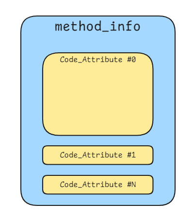
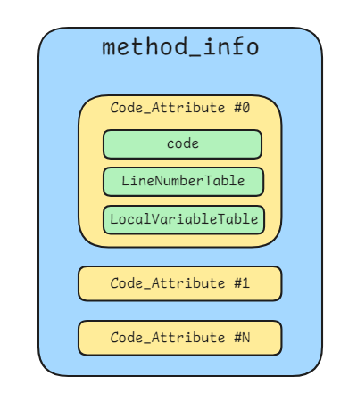
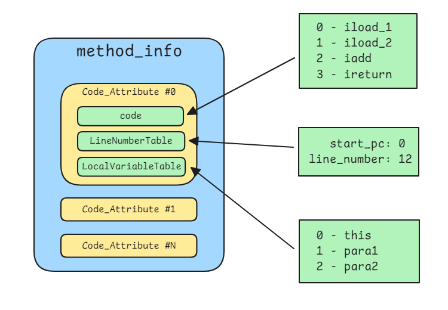
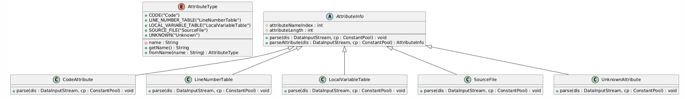

# The Method Info

In the previous discussion, we gained a general understanding of the Java class file structure. Now, let’s dive deeper into one of its most critical components: **the methods section**.

## The `method_info` Structure

Each method within a class file is represented by a `method_info` structure. This structure compactly stores the method’s metadata and attributes.



```
method_info {
    u2             access_flags;
    u2             name_index;
    u2             descriptor_index;
    u2             attributes_count;
    attribute_info attributes[attributes_count];
}
```

Consider the following example method:

```java
public int add (int a, int b){
    return a + b;
}
```

- **access_flags**: A bitmask defining the method’s access permissions and properties. In this case, `public`.

- **name_index**: A constant pool index pointing to the method name `add`.

- **descriptor_index**: A constant pool index pointing to the method descriptor, which encodes the parameter and return types. For `public int add(int a, int b)`, the descriptor is `(II)I`, meaning the method takes two integers (`II`) and returns an integer (`I`).

- **attributes**: An array of `attribute_info` structures. For a standard method with code, the most important attribute is the Code Attribute.

## Code Attribute

The Code attribute is the core of a method, as it holds the bytecode instructions executed by the JVM. 



It has its own structure:

```
Code_attribute {
    u2 attribute_name_index;
    u4 attribute_length;
    u2 max_stack;
    u2 max_locals;
    u4 code_length;
    u1 code[code_length];
    u2 exception_table_length;
    {   u2 start_pc;
        u2 end_pc;
        u2 handler_pc;
        u2 catch_type;
    } exception_table[exception_table_length];
    u2 attributes_count;
    attribute_info attributes[attributes_count];
}
```

- **attribute_name_index**: A constant pool index pointing to `Code`.

- **max_stack**: TThe maximum depth of the **operand stack** needed during execution. In our example, it is 2 (enough to hold two integers for the addition).

- **max_locals**: The number of slots in the local variable array. This includes parameters and local variables. For an instance method, slot 0 is reserved for `this`. In our example, `max_locals` = 3 (`this`, `a`, and `b`).

- **code**: The actual bytecode instructions. For the add method, the sequence is 1B 1C 60 AC:

   - 1B (`iload_1`): loads `a` from local variable slot 1

   - 1C (`iload_2`): loads `b` from local variable slot 2

   - 60 (`iadd`): pops two integers, adds them, and pushes the result

   - AC (`ireturn`): returns an integer

## Nested Attributes: Providing Context

The Code attribute may itself contain attributes that provide additional metadata, especially useful for debugging.



### LineNumberTable Attribute

This attribute maps bytecode offsets to source code line numbers, enabling debuggers to relate runtime execution back to the source.

```
LineNumberTable_attribute {
    u2 attribute_name_index;
    u4 attribute_length;
    u2 line_number_table_length;
    {   u2 start_pc;
        u2 line_number;	
    } line_number_table[line_number_table_length];
}
```

For our method, the table has one entry:

- start_pc (0): The first bytecode instruction.

- line_number (15): The line number in the source file.

This tells the debugger that execution starting at bytecode offset 0 corresponds to line 15 in the source file.

### LocalVariableTable Attribute

This attribute records metadata about local variables, allowing tools to display their names and types.

```LocalVariableTable_attribute {
    u2 attribute_name_index;
    u4 attribute_length;
    u2 local_variable_table_length;
    {   u2 start_pc;
        u2 length;
        u2 name_index;
        u2 descriptor_index;
        u2 index;
    } local_variable_table[local_variable_table_length];
}
```

In our add method, `local_variable_table_length` = 3, representing the three locals: `this`, `a`, and `b`.

For the second variable `a`, an entry might look like:

- **start_pc** (0) and **length** (4): The scope of the variable.

- **name_index**: Constant pool index pointing to `a`.

- **descriptor_index**: Points to `I`, representing type `int`.

- **index** (1): Stored in local variable slot 1.

# Attribute Design in this Project

The following UML class diagram illustrates the design of class file attributes in this JVM project.

- `AttributeInfo` is the abstract base class representing any attribute in a Java class file.

- Concrete subclasses (`CodeAttribute`, `LineNumberTable`, `LocalVariableTable`, `SourceFile`, `UnknownAttribute`) implement parsing and storage for specific attribute types.

- `AttributeType` enum is used to identify the attribute type and assist in selecting the correct subclass during parsing.



