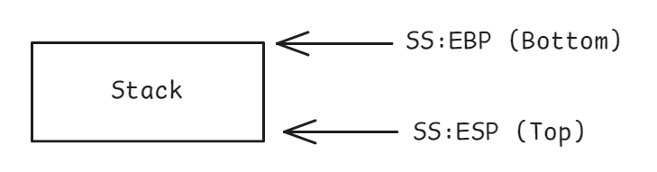
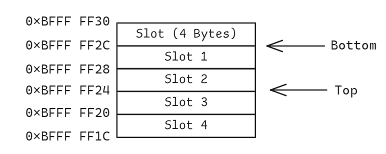
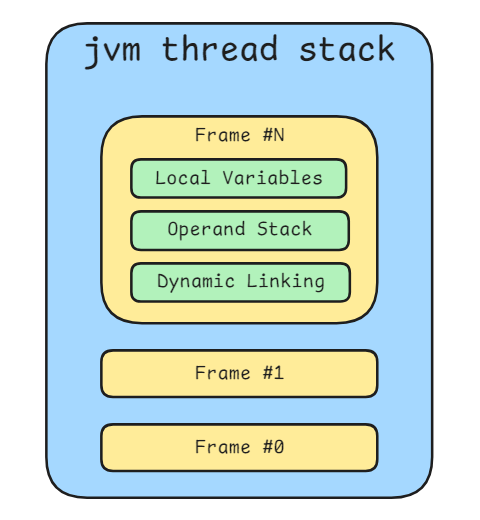

# Stack

In computing, a stack is a fundamental data structure used to manage program execution. It's the mechanism that allows functions or methods to call one another and return in an orderly fashion. While the concept is universal, its implementation can vary significantly between a low-level operating system environment like Linux and a high-level managed environment like the JVM

## Linux Thread Stack

At the operating system level, a thread's stack is a contiguous block of memory managed directly by the CPU. It follows a **strict Last-In, First-Out (LIFO)** order, meaning the last piece of data pushed onto the stack is the first one to be popped off. This memory region is essential for managing function calls, passing parameters, and storing local variables.

In a typical x86 architecture, the stack is manipulated through a set of dedicated CPU registers:

- **Stack Segment (SS)**: Stores the base address of the stack segment.
- **Stack Pointer (ESP/RSP)**: Always points to the "top" of the stack, the memory address where the next item will be pushed.
- **Base Pointer (EBP/RBP)**: Also known as the Frame Pointer, this points to the base of the current function's stack frame. A stack frame is the section of the stack dedicated to a single function call. Using a fixed base pointer makes it easy and reliable to access function arguments and local variables, even as the stack pointer moves.



In 32-bit x86 architectures, the stack is organized into basic units called slots, each 4 bytes in size.



On 64-bit x86-64 architectures, the slot size is expanded to 8 bytes to match the 64-bit word size of the CPU.

### Core Stack Operations

The CPU uses a small set of instructions to directly manipulate the stack.

`push`: Places data onto the stack. The stack pointer is decreased (since the stack grows downwards in memory), and the value is stored at the new address, equals:

```asm
sub esp, 4
mov dword ptr [esp], value
```

`pop`: Retrieves data from the top of the stack. This reads the value at the top of the stack and then increases the stack pointer, equals:

```asm
mov eax, [esp]
add esp, 4
```
`call`: Transfers control to a subroutine. It first pushes the return address (the location of the next instruction) onto the stack and then jumps to the subroutine's code, equals:

```asm
push [address of next instruction]
jmp [subroutine]
```

`ret`: Returns from a subroutine. It retrieves the return address from the stack and transfers control back to it, equals:

```asm
pop eip
```

`leave`: Cleans up the current stack frame. It effectively restores the stack pointer and base pointer to their original state before the current function was called, equals:

```asm
mov esp, ebp
pop ebp
```

In this native environment, the stack is a low-level, hardware-driven memory structure. It's fast and efficient but requires direct manipulation of memory and registers, making it prone to errors like buffer overflows if not handled carefully.

## JVM Thread Stack

The JVM stack represents a higher-level approach to the same concept. When a Java program runs, the JVM creates a private stack for each thread, which tracks method calls and their execution state.

Like its native counterpart, the JVM stack is made up of **frames**. A new frame is created and pushed onto the stack each time a Java method is invoked. When a method finishes, its frame is popped from the stack.

### Java Frame

A Java frame is a more complex data structure that contains three primary components:

- **Local Variable Array**: Holds method parameters and local variables.

- **Operand Stack**: A LIFO "scratchpad" used for performing calculations and preparing method arguments.

- **Dynamic Linking**: A reference to runtime data that allows method calls to be resolved during execution.



### Core JVM Stack Operations (via Bytecode)

The JVM uses bytecode instructions, which are more abstract than assembly. These instructions manipulate the **Local Variable Array** and **Operand Stack** within the current frame.

`iload_n`: Loads an integer from the local variable at index n and pushes it onto the operand stack.

`istore_n`: Pops an integer from the operand stack and stores it into the local variable at index n.

`iadd`: Pops two integers from the operand stack, adds them, and pushes the result back onto the operand stack.

`invokevirtual`: Invokes an instance method, performing dynamic dispatch and creating a new frame for the target method.

`ireturn`: Returns an integer value from the current method. The value is popped from the current operand stack and pushed onto the caller's operand stack, after which the current frame is discarded.

Ultimately, the JVM stack provides a safe, flexible, and platform-independent execution environment. It is built on the same fundamental principles as a native Linux stack but trades direct hardware control for portability and runtime safety.