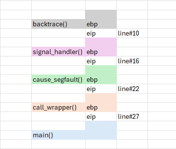
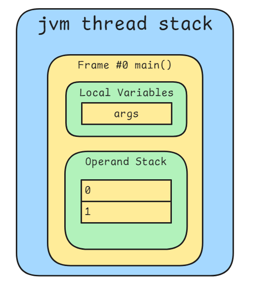
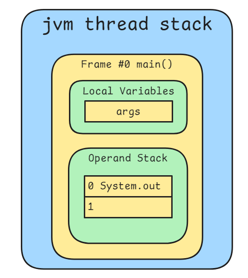
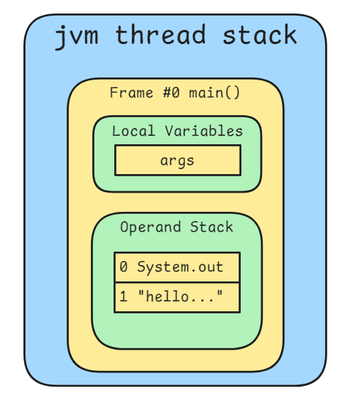

# Function

A **function** (or **routine**) is a core programming concept. It is a reusable block of code designed to perform a specific task.

Functions help organize code into logical units, improve readability, and reduce redundancy by allowing the same code to be executed multiple times with different inputs.

## Procedure

When a function is called, the program follows a series of steps to execute it.

Below is an example of how a function is accessed and executed in assembly language:

### 1. Enter the Function

   The function is called using a `call` instruction.

    ```asm
    call [subroutine]
    ```


### 2. Create a Stack Frame

   A stack frame is created to store local variables and function parameters.

    ```asm
    push ebp        ; Save the base pointer
    mov ebp, esp    ; Set the base pointer to the current stack pointer
    ```

### 3. Save Context

   Registers used by the function are saved to preserve the caller's context.

    ```asm
    push ebx        ; Save EBX
    push esi        ; Save ESI
    push edi        ; Save EDI
    ```

### 4. Execute Function Logic

   The function performs its intended task using the provided parameters and local variables.


### 5. Restore Context

   The saved registers are restored to their original values.

   ```asm
   pop edi         ; Restore EDI
   pop esi         ; Restore ESI
   pop ebx         ; Restore EBX
   ```

### 6. Release the Stack Frame

   The stack frame is released, and control is returned to the caller.

    ```asm
    leave           ; Equivalent to: mov esp, ebp; pop ebp
    ret             ; Return to the caller
    ```

### Stack Diagram for Nested Calls

When multiple functions call each other, the stack grows accordingly. A simplified view:



# Java Function

In Java, a function is typically called a **method**. Methods are blocks of code defined within a class that perform specific tasks. Unlike standalone functions in some languages, Java methods are always associated with an object (or class, if static).

## Defining a Method

Here is a simple example:

```java
public class HelloWorld {

    public static void main(String[] args) {
        System.out.println("hello, world");
    }

}
```

In this program, `main()` is the entry point of the program, also a static method which belongs to the class.

## Method Execution

When `main()` is called, the JVM executes it using bytecode instructions, which work similarly to assembly-level operations.

### Viewing Bytecode of main

fter compilation, you can inspect the generated `.class` file with the `javap -c` command:

```cmd
cmd > dir com\avaya\jvm\example\HelloWorld.class
09/26/2025  11:26 AM               578 HelloWorld.class


cmd > javap -c com.avaya.jvm.example.HelloWorld
Compiled from "HelloWorld.java"
public class com.avaya.jvm.example.HelloWorld {
  public com.avaya.jvm.example.HelloWorld();
    Code:
       0: aload_0
       1: invokespecial #1                  // Method java/lang/Object."<init>":()V
       4: return

  public static void main(java.lang.String[]);
    Code:
       0: getstatic     #7                  // Field java/lang/System.out:Ljava/io/PrintStream;
       3: ldc           #13                 // String hello, world
       5: invokevirtual #15                 // Method java/io/PrintStream.println:(Ljava/lang/String;)V
       8: return
}
```
### Step-by-Step Execution 

Let’s break down what happens when the `main` method runs:

**1. Method call**: When main is invoked, the JVM creates a new stack frame. Its **local variable array** is initialized with the `args` parameter, and the **operand stack** is initially empty.



**2. getstatic**: This instruction retrieves the static field `System.out`, which is a `PrintStream` object used for console output. A reference to this object is pushed onto the operand stack.



**3. ldc (load constant)**: This instruction loads the string constant "hello, world" from the constant pool and pushes it onto the operand stack. At this point, the operand stack contains two items:
- the `PrintStream` object (`System.out`)
- the `String` object ("hello, world")



**4. invokevirtual**: This instruction calls the `println` method of the `PrintStream` object. The JVM pops the two items from the operand stack, passes them as arguments, and creates a new stack frame for the method call. After `println` executes (printing to the console), control returns to the `main` method.

**5. return**: With no more instructions to execute, the `main` method completes. Its stack frame is popped off, and since main is the entry point of the program, this thread ends.
