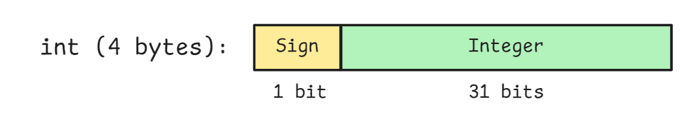
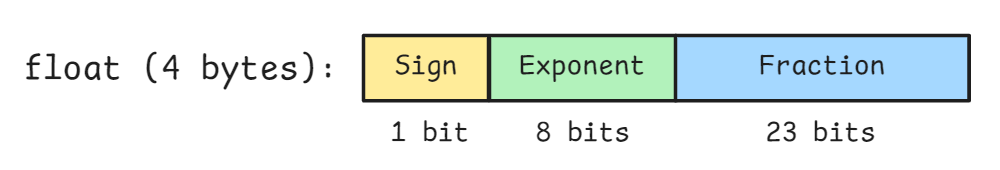
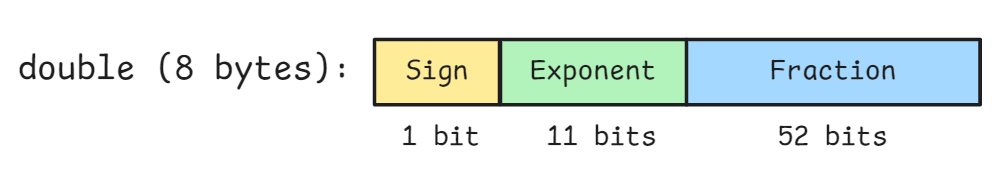

# Data Type in C

At its core, a computer fundamentally runs by having the CPU operate on addresses and the data (memory or I/O ports). To indicate how much a value occupies and how it should be interpreted, we use data types. A solid understanding of basic data types is essential for writing correct and efficient programs.

## Endianness

Endianness describes the order in which bytes of a multi-byte value are stored or transmitted. There are two main types:

- **Little-endian**: The **least significant byte (LSB)** is stored at the lowest memory address, while the **most significant byte (MSB)** is stored at the highest address. For example, the 32-bit integer `0x12345678` would be stored in memory as:
    ```
    Address: 0x00  0x01  0x02  0x03
    Value:   0x78  0x56  0x34  0x12
    ```

- **Big-endian**: The **MSB** is stored at the lowest address, and the **LSB** at the highest. Using the same integer:
    ```
    Address: 0x00  0x01  0x02  0x03
    Value:   0x12  0x34  0x56  0x78
    ```

Modern CPUs (X86 and ARM) primarily use little-endian format, while some network protocols and certain legacy CPU architectures use big-endian.


## Integers

C integers can be signed or unsigned and come in several sizes. For simplicity, we discuss the most common signed types:

| Type  | Size         | 
|:------|:-------------|
| char  | 1 byte       | 
| short | 2 bytes      |
| int   | 4 bytes      | 
| long  | 4 or 8 bytes |

Signed integers use the most significant bit (MSB) as the sign bit:




- **Positive numbers**: Represented directly in binary.

- **Negative numbers**: Stored using two’s complement, which is calculated by inverting all bits (one’s complement) and adding 1.

Example (8-bit signed integer):
```
+5:  00000101
-5:  11111011  (invert 00000101 → 11111010, add 1 → 11111011)
```


## Floating-Point Numbers

C provides **float (single-precision)** and **double (double-precision)** following the IEEE 754 standard.


| Type   | Size         | 
|:-------|:-------------|
| float  | 4 byte       | 
| double | 8 bytes      |

A floating-point number consists of three parts:

- **Sign bit (S)**: 0 for positive, 1 for negative.

- **Exponent (E)**: Stored with a bias to represent both positive and negative exponents.

- **Fraction / Mantissa (M)**: Contains the significant digits of the number.





## Verification

```c
// data_type.c

int main() {
    char c = 0x10;
    char cn = -0x10;
	
    short s = 0x1234;
    short sn = -0x1234;
	
    int i = 0x12345678;
    int in = -0x12345678;
	
    long l = 0x12345678ABCDEF01;
    long ln = -0x12345678ABCDEF01;
	
    float f = 3.14f;
    float fn = -3.14f;
	
    double d = 3.141592653589793;
    double dn = -3.141592653589793;

    return 0;
}
```

```shell
cmd > gcc data_type.c -o data_type -g
cmd > gdb data_type
  (gdb) disassemble main
  Dump of assembler code for function main:
     0x0000000000400536 <+0>:     push   %rbp
     0x0000000000400537 <+1>:     mov    %rsp,%rbp
     0x000000000040053a <+4>:     movb   $0x10,-0x1(%rbp)
     0x000000000040053e <+8>:     movb   $0xf0,-0x2(%rbp)
     0x0000000000400542 <+12>:    movw   $0x1234,-0x4(%rbp)
     0x0000000000400548 <+18>:    movw   $0xedcc,-0x6(%rbp)
     0x000000000040054e <+24>:    movl   $0x12345678,-0xc(%rbp)
     0x0000000000400555 <+31>:    movl   $0xedcba988,-0x10(%rbp)
     0x000000000040055c <+38>:    movabs $0x12345678abcdef01,%rax
     0x0000000000400566 <+48>:    mov    %rax,-0x18(%rbp)
     0x000000000040056a <+52>:    movabs $0xedcba987543210ff,%rax
     0x0000000000400574 <+62>:    mov    %rax,-0x20(%rbp)
     0x0000000000400578 <+66>:    movss  0xd8(%rip),%xmm0        # 0x400658
     0x0000000000400580 <+74>:    movss  %xmm0,-0x24(%rbp)
     0x0000000000400585 <+79>:    movss  0xcf(%rip),%xmm0        # 0x40065c
     0x000000000040058d <+87>:    movss  %xmm0,-0x28(%rbp)
     0x0000000000400592 <+92>:    movsd  0xc6(%rip),%xmm0        # 0x400660
     0x000000000040059a <+100>:   movsd  %xmm0,-0x30(%rbp)
     0x000000000040059f <+105>:   movsd  0xc1(%rip),%xmm0        # 0x400668
     0x00000000004005a7 <+113>:   movsd  %xmm0,-0x38(%rbp)
     0x00000000004005ac <+118>:   mov    $0x0,%eax
     0x00000000004005b1 <+123>:   pop    %rbp
     0x00000000004005b2 <+124>:   retq
  (gdb) break *0x00000000004005ac
  (gdb) run
  ## i= 0x12345678
  (gdb) x/4xb &i
  0x7fffffffe4d4: 0x78    0x56    0x34    0x12
  ## in= -0x12345678
  (gdb) x/4xb &in
  0x7fffffffe4d0: 0x88    0xa9    0xcb    0xed
  ## f = 3.14f;
  (gdb) x/4xb &f
  0x7fffffffe4bc: 0xc3    0xf5    0x48    0x40
  ## fn = -3.14f;
  (gdb) x/4xb &fn
  0x7fffffffe4b8: 0xc3    0xf5    0x48    0xc0
```

# Data Type in Java

Java, unlike C, defines fixed and platform-independent sizes for all primitive types.

At the JVM level, primitive types are stored and processed using a slot-based model, both in the **operand stack** and the **local variable table**.

Each slot is 32 bits (4 bytes) wide, and all data types are built upon this foundation.


| Type    | Size    | Slot | Description                |
|:--------|:--------|:-----|:---------------------------|
| boolean | 1 byte  | 1    | logical value (0 or 1)     | 
| byte    | 1 byte  | 1    | signed integer             | 
| short   | 2 bytes | 1    | signed integer             | 
| char    | 2 bytes | 1    | unsigned UTF-16 code unit  | 
| int     | 4 bytes | 1    | signed integer             | 
| long    | 8 bytes | 2    | signed integer             | 
| float   | 4 bytes | 1    | IEEE 754 single precision  | 
| double  | 8 bytes | 2    | IEEE 754 double precision  | 


## Integers

These include: **boolean**, **byte**, **char**, **short**, **int**, and **long**.

Most of them (except **long**) are represented as 32-bit integers inside the JVM.
Even though their logical sizes differ in Java source code, the JVM promotes them to 32-bit for computation.

```java
boolean b = true;
byte x = 10;
char c = 'A';
short s = 300;
int i = 1000;
```

All of the above are operated on using int-based bytecode instructions (`iload`, `istore`, `iadd`, etc.).

**long** is the only 64-bit numeric type, occupying two consecutive 32-bit slots

In arrays, each element still uses its actual Java-defined size
(for example, `boolean[ ]` = 1 byte per element, `char[ ]` = 2 bytes per element).


## Floating-Point Numbers

Floating-point types are **float** and **double**, following the IEEE 754 standard.

They use a separate instruction set (`fload`, `fstore`, `dload`, `dstore`, etc.) for operations.


