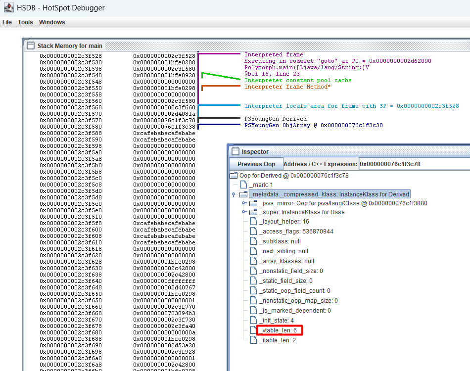

# Polymorphism

**Polymorphism** is one of the key principles of **Object-Oriented Programming (OOP)**. It means that the same method call can have different behaviors depending on the actual type of the object.

Both C++ and Java use a similar idea called a **Virtual Method Table (V-Table)** to make this possible. The V-Table helps the program decide, at runtime, which version of a method to call.

## Polymorphism in C++

In C++, you must explicitly mark a method as virtual to make it polymorphic.

When a class has virtual methods, the compiler adds a hidden **vptr (virtual pointer)** inside each object. This pointer refers to a **vtable (virtual method table)** — a list of addresses for all virtual functions.

Let’s look at an example:

```cpp
// polymorph.cpp
#include <iostream>

class Base {
public:
    virtual void hello() { std::cout << "Base::hello\n"; }
    void nonvirtual() { std::cout << "Base::nonvirtual\n"; }
    virtual ~Base() = default;
};

class Derived : public Base {
public:
    void hello() override { std::cout << "Derived::hello\n"; }
    void nonvirtual() { std::cout << "Derived::nonvirtual\n"; }
};

int main() {
    Base* p = new Derived();
    p->hello();
    p->nonvirtual();
    return 0;
}
```

At runtime:

When `p->hello()` is called, the program uses the **vtable** to find the correct function (in this case, `Derived::hello()`) and jumps to it, this is **dynamic dispatch**.

When `p->nonvirtual()` is called, the call target is already fixed during the build process, so no **vtable** lookup occurs at runtime, this is **static dispatch**.

### Inspecting the vtable with GDB

```shell
cmd > g++ -g polymorph.cpp -o polymorph
cmd > gdb ./polymorph
  (gdb) break main
  (gdb) run
  (gdb) next
  (gdb) info locals
    p = 0x614eb0
  ## Inspect the value of the Base pointer 'p'
  ## It points to a Derived object whose first field is the vptr at 0x400b98
  (gdb) x/2gx 0x614eb0
    0x614eb0:       0x0000000000400b98      0x0000000000000000
  ## Examine the vtable, which contains 3 function addresses
  (gdb) x/4gx 0x0000000000400b98
    0x400b98 <_ZTV7Derived+16>:     0x00000000004009ca      0x0000000000400a6c
    0x400ba8 <_ZTV7Derived+32>:     0x0000000000400a94      0x0000000000000000
  ## vtable entries:
  ## 0x40009ca - virtual function 'hello()'
  ## 0x4000a6c - Complete Destructor (for stack object)
  ## 0x4000a94 - Deleting Destructor (for heap object)
  (gdb) info symbol 0x00000000004009ca
    Derived::hello() in section .text of /root/c/polymorph
  (gdb) info symbol 0x0000000000400a6c
    Derived::~Derived() in section .text of /root/c/polymorph
  (gdb) info symbol 0x0000000000400a94
    Derived::~Derived() in section .text of /root/c/polymorph
    
  ## Check how a virtual function call works
  (gdb) disassemble /s
    18          p->hello();
       ## Load the object pointer 'p' into RAX
    => 0x000000000040090f <+41>:    mov    -0x18(%rbp),%rax
       ## Load the vptr from the object into RAX
       0x0000000000400913 <+45>:    mov    (%rax),%rax
       ## Load the function address (first entry of vtable) into RAX
       0x0000000000400916 <+48>:    mov    (%rax),%rax
       ## Load the object pointer 'p' into RDI as 'this'
       0x0000000000400919 <+51>:    mov    -0x18(%rbp),%rdx
       0x000000000040091d <+55>:    mov    %rdx,%rdi
       ## Call the virtual function 'hello()' via the vtable entry
       0x0000000000400920 <+58>:    callq  *%rax
  
  ## Check how a normal (non-virtual) function call works
    19          p->nonvirtual();
       ## Load the object pointer 'p' into RDI as 'this'
       0x0000000000400922 <+60>:    mov    -0x18(%rbp),%rax
       0x0000000000400926 <+64>:    mov    %rax,%rdi
       ## Directly call the function (no vtable lookup)
       0x0000000000400929 <+67>:    callq  0x4009ac <Base::nonvirtual()>
```


## Polymorphism in Java

In Java, polymorphism is the default for all instance methods, except those marked `final` or `private`. 

Unlike C++, you don’t need to declare methods as `virtual`, the JVM automatically handles **dynamic method dispatch** using an internal structure called a **virtual method table (V-Table)**.

Consider the Java code:

```java
// Polymorph.java
class Base {
    public void hello() {
        System.out.println("Base::hello");
    }

    public final void nonvirtual() {
        System.out.println("Base::nonvirtual");
    }
}

class Derived extends Base {
    @Override
    public void hello() {
        System.out.println("Derived::hello");
    }
}

public class Polymorph {
    public static void main(String[] args) {
        Base p = new Derived();
        p.hello();
        p.nonvirtual();
        while(true);
    }
}
```

`p.hello()` executes `Derived::hello()` even though `p` is typed as `Base`.

`p.nonvirtual() `executes `Base::nonvirtual()` because it is final and cannot be overridden.

### Bytecode and Dispatch

Using `javap`, we can inspect the compiled bytecode:

```shell
cmd > javac Polymorph.java
cmd > java Polymorph
    Derived::hello
    Base::nonvirtual
cmd > javap -c -p Polymorph
Compiled from "Polymorph.java"
public class Polymorph {
  public Polymorph();
    Code:
       0: aload_0
       1: invokespecial #1                  // Method java/lang/Object."<init>":()V
       4: return

  public static void main(java.lang.String[]);
    Code:
       0: new           #2                  // class Derived
       3: dup
       4: invokespecial #3                  // Method Derived."<init>":()V
       7: astore_1
       8: aload_1
       ## Note: Bytecode shows Base.hello because it stores the symbolic reference.
       ## At runtime, JVM resolves this to the actual method based on the object's
       ## type (Derived), so Derived.hello() is called.
       9: invokevirtual #4                  // Method Base.hello:()V
      12: aload_1
      13: invokevirtual #5                  // Method Base.nonvirtual:()V
      16: return
}

cmd > java Polymorph &
cmd > jps
  535485 Polymorph
cmd > hsdb
```



Even though `invokevirtual` is used for both calls, JVM handles them differently:

**Dynamic call**: `p.hello()` resolves to `Derived.hello()` at runtime

**Static call**: `p.nonvirtual()` calls `Base.nonvirtual()`

### invokevirtual workflow

In bytecode, `Base.hello` appears as a symbolic reference, but at runtime, the JVM ensures the call executes `Derived.hello`. 

Here's how it works step by step.

#### 1. Symbolic Resolution

Before actually running a method, the JVM needs to link the bytecode to the method definition. This is called **resolution**.

- **Reading the Reference**: The `invokevirtual` instruction contains an index pointing to the class's Runtime Constant Pool, which stores a symbolic reference (e.g., `Base.hello:()V`).

- **Locating the Signature**: The JVM resolves this symbolic reference by searching the static type (e.g., Base) and its superclasses to find the method's declaration.

- **Establishing the V-Table Index**: The critical output of this static phase is the determination of a fixed index. This index represents the method's position (or slot) in the class hierarchy's V-Table. Regardless of which subclass implements the method, the signature for `hello()` will always occupy the same slot across all derived classes.

At this point, the JVM knows where to look (the fixed index), but not what the final address is.

#### 2. Dynamic Dispatch

When `invokevirtual` executes, JVM dynamically finds the actual method based on the object’s runtime type:

- **Identify the Object**: JVM pops the object reference (`this`) from the operand stack and reads its pointer to the actual runtime class. (e.g., `Derived`).

- **Access the V-Table**: It then uses the vtable slot obtained during symbolic resolution to look up the method in the class’s vtable.

- **Obtaining the Direct Reference**: This slot contains a direct reference to the correct implementation (e.g., `Derived.hello()`), which JVM invokes.

This process efficiently ensures that the correct overridden method is called without repeated name or signature matching.

#### 3. Method Invocation

Once JVM finds the target method:

- **Pop arguments**: Pop `this` and the method arguments from the caller’s operand stack.

- **Create stack frame**: Allocate a new stack frame for the method.

- **Initialize local variables**: Copy arguments into the new frame’s local variable array (`this` is at slot 0).

- **Set PC**: Set the Program Counter (PC) to the start of the method’s bytecode.

- **Execute**: Begin executing the method.